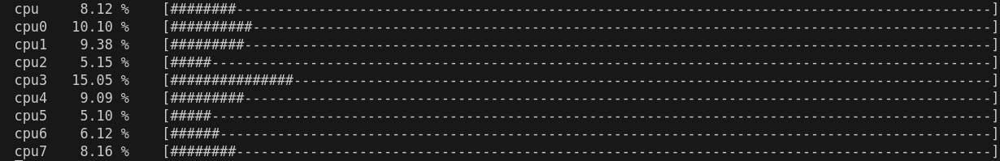

# SIMPLE CPU USAGE ANALYZER 

```
How to build on ubuntu 22.04 with cmake: 

1. Go to the main directory, open terminal and write "cmake -S . -B build -G Ninja" command

2. Next write "Ninja -C build" command then in directory "build" file "CpuUsageTracker" will be created

Application can be closed with
```
# SCREENSHOT

